# Домашнее задание к занятию «Основы Terraform. Yandex Cloud»

### Цели задания

1. Создать свои ресурсы в облаке Yandex Cloud с помощью Terraform.
2. Освоить работу с переменными Terraform.


### Чек-лист готовности к домашнему заданию

1. Зарегистрирован аккаунт в Yandex Cloud. Использован промокод на грант.
2. Установлен инструмент Yandex CLI.
3. Исходный код для выполнения задания расположен в директории [**02/src**](https://github.com/netology-code/ter-homeworks/tree/main/02/src).


### Задание 0

1. Ознакомьтесь с [документацией к security-groups в Yandex Cloud](https://cloud.yandex.ru/docs/vpc/concepts/security-groups?from=int-console-help-center-or-nav). 
Этот функционал понадобится к следующей лекции.

------
### Внимание!! Обязательно предоставляем на проверку получившийся код в виде ссылки на ваш github-репозиторий!
------

### Задание 1
В качестве ответа всегда полностью прикладывайте ваш terraform-код в git.
Убедитесь что ваша версия **Terraform** ~>1.12.0

1. Изучите проект. В файле variables.tf объявлены переменные для Yandex provider.
2. Создайте сервисный аккаунт и ключ. [service_account_key_file](https://terraform-provider.yandexcloud.net).
4. Сгенерируйте новый или используйте свой текущий ssh-ключ. Запишите его открытую(public) часть в переменную **vms_ssh_public_root_key**.
5. Инициализируйте проект, выполните код. Исправьте намеренно допущенные синтаксические ошибки. Ищите внимательно, посимвольно. Ответьте, в чём заключается их суть.
6. Подключитесь к консоли ВМ через ssh и выполните команду ``` curl ifconfig.me```.
Примечание: К OS ubuntu "out of a box, те из коробки" необходимо подключаться под пользователем ubuntu: ```"ssh ubuntu@vm_ip_address"```. Предварительно убедитесь, что ваш ключ добавлен в ssh-агент: ```eval $(ssh-agent) && ssh-add``` Вы познакомитесь с тем как при создании ВМ создать своего пользователя в блоке metadata в следующей лекции.;
8. Ответьте, как в процессе обучения могут пригодиться параметры ```preemptible = true``` и ```core_fraction=5``` в параметрах ВМ.

В качестве решения приложите:

- скриншот ЛК Yandex Cloud с созданной ВМ, где видно внешний ip-адрес;
- скриншот консоли, curl должен отобразить тот же внешний ip-адрес;
- ответы на вопросы.

------

### Решение

4. Исправление ошибок.

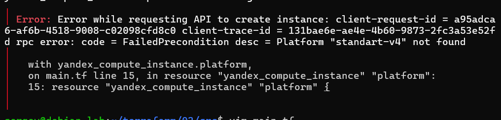

  - Платформа `"standart-v4"` не найдена ([список платформ](https://yandex.cloud/ru/docs/compute/concepts/vm-platforms), заменил на `standard-v3`)

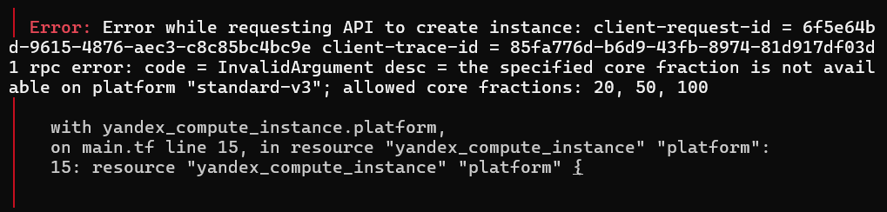

  - Доля ядра не доступна для платформы `standard-v3`, доступны: 20, 50, 100 (изменил на 20)

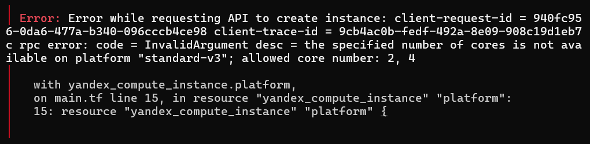

  - Количество ядер не доступно для платформы `standard-v3`, доступны: 2, 4 (изменил на 2)

5. Проверка внешнего IP

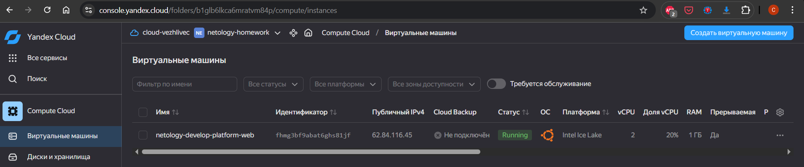

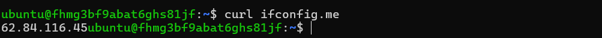

6. Параметры `preemptible = true` и `core_fraction=5` экономят грант, уменьшая стоимость ВМ.

------

### Задание 2

1. Замените все хардкод-**значения** для ресурсов **yandex_compute_image** и **yandex_compute_instance** на **отдельные** переменные. К названиям переменных ВМ добавьте в начало префикс **vm_web_** .  Пример: **vm_web_name**.
2. Объявите нужные переменные в файле variables.tf, обязательно указывайте тип переменной. Заполните их **default** прежними значениями из main.tf. 
3. Проверьте terraform plan. Изменений быть не должно. 

------

1. Исправления в `main.tf`

```hcl
resource "yandex_vpc_network" "develop" {
  name = var.vpc_name
}

resource "yandex_vpc_subnet" "develop" {
  name           = var.vpc_name
  zone           = var.default_zone
  network_id     = yandex_vpc_network.develop.id
  v4_cidr_blocks = var.default_cidr
}

data "yandex_compute_image" "ubuntu" {
  family = var.vm_web_image_family
}

resource "yandex_compute_instance" "platform" {
  name        = var.vm_web_name
  platform_id = var.vm_web_platform_id

  resources {
    cores         = var.vm_web_cores
    memory        = var.vm_web_memory
    core_fraction = var.vm_web_core_fraction
  }

  boot_disk {
    initialize_params {
      image_id = data.yandex_compute_image.ubuntu.image_id
    }
  }

  scheduling_policy {
    preemptible = var.vm_web_preemptible
  }

  network_interface {
    subnet_id = yandex_vpc_subnet.develop.id
    nat       = var.vm_web_nat
  }

  metadata = {
    serial-port-enable = 1
    ssh-keys           = "ubuntu:${var.vms_ssh_root_key}"
  }
}
```

2. Добавил блок VM vars в `variables.tf`

```hcl
### VM vars

variable "vm_web_image_family" {
  description = "Image family for the boot disk"
  type        = string
  default     = "ubuntu-2004-lts"
}

variable "vm_web_name" {
  description = "Name of the VM"
  type        = string
  default     = "netology-develop-platform-web"
}

variable "vm_web_platform_id" {
  description = "Platform ID"
  type        = string
  default     = "standard-v3"
}

variable "vm_web_cores" {
  description = "Number of CPU cores"
  type        = number
  default     = 2
}

variable "vm_web_memory" {
  description = "Amount of RAM in GB"
  type        = number
  default     = 1
}

variable "vm_web_core_fraction" {
  description = "Core fraction %"
  type        = number
  default     = 20
}

variable "vm_web_preemptible" {
  description = "If true, the instance is preemptible"
  type        = bool
  default     = true
}

variable "vm_web_nat" {
  description = "Enable public IP (NAT)"
  type        = bool
  default     = true
}
```

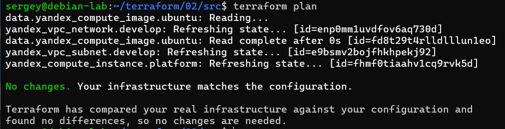

------

### Задание 3

1. Создайте в корне проекта файл 'vms_platform.tf' . Перенесите в него все переменные первой ВМ.
2. Скопируйте блок ресурса и создайте с его помощью вторую ВМ в файле main.tf: **"netology-develop-platform-db"** ,  ```cores  = 2, memory = 2, core_fraction = 20```. Объявите её переменные с префиксом **vm_db_** в том же файле ('vms_platform.tf').  ВМ должна работать в зоне "ru-central1-b"
3. Примените изменения.

------

### Решение

1. Файл `vms_platform.tf`

```hcl
### VM vars

variable "vm_web_image_family" {
  description = "Image family for the boot disk"
  type        = string
  default     = "ubuntu-2004-lts"
}

variable "vm_web_name" {
  description = "Name of the VM"
  type        = string
  default     = "netology-develop-platform-web"
}

variable "vm_web_platform_id" {
  description = "Platform ID"
  type        = string
  default     = "standard-v3"
}

variable "vm_web_cores" {
  description = "Number of CPU cores"
  type        = number
  default     = 2
}

variable "vm_web_memory" {
  description = "Amount of RAM in GB"
  type        = number
  default     = 1
}

variable "vm_web_core_fraction" {
  description = "Core fraction %"
  type        = number
  default     = 20
}

variable "vm_web_preemptible" {
  description = "If true, the instance is preemptible"
  type        = bool
  default     = true
}

variable "vm_web_nat" {
  description = "Enable public IP (NAT)"
  type        = bool
  default     = true
}

### VM DB vars

variable "vm_db_image_family" {
  description = "Image family for the boot disk"
  type        = string
  default     = "ubuntu-2004-lts"
}

variable "vm_db_name" {
  description = "Name of the VM"
  type        = string
  default     = "netology-develop-platform-db"
}

variable "vm_db_platform_id" {
  description = "Platform ID"
  type        = string
  default     = "standard-v3"
}

variable "vm_db_cores" {
  description = "Number of CPU cores"
  type        = number
  default     = 2
}

variable "vm_db_memory" {
  description = "Amount of RAM in GB"
  type        = number
  default     = 2
}

variable "vm_db_core_fraction" {
  description = "Core fraction %"
  type        = number
  default     = 20
}

variable "vm_db_preemptible" {
  description = "If true, the instance is preemptible"
  type        = bool
  default     = true
}

variable "vm_db_nat" {
  description = "Enable public IP (NAT)"
  type        = bool
  default     = true
}
```

2. Добавил ресурс в `main.tf`

```hcl
resource "yandex_compute_instance" "platform_db" {
  name        = var.vm_db_name
  zone        = var.default_db_zone
  platform_id = var.vm_db_platform_id

  resources {
    cores         = var.vm_db_cores
    memory        = var.vm_db_memory
    core_fraction = var.vm_db_core_fraction
  }

  boot_disk {
    initialize_params {
      image_id = data.yandex_compute_image.ubuntu.image_id
    }
  }

  scheduling_policy {
    preemptible = var.vm_db_preemptible
  }

  network_interface {
    subnet_id = yandex_vpc_subnet.develop_db.id
    nat       = var.vm_db_nat
  }

  metadata = {
    serial-port-enable = 1
    ssh-keys           = "ubuntu:${var.vms_ssh_root_key}"
  }
}
```

Чтобы ВМ работала в другой зоне, необходимо создать подсеть в этой зоне (ещё один ресурс в `main.tf`)

```hcl
resource "yandex_vpc_subnet" "develop_db" {
  name           = var.subnet_db_name
  zone           = var.default_db_zone
  network_id     = yandex_vpc_network.develop.id
  v4_cidr_blocks = var.default_db_cidr
}
```

И три переменных в `variables.tf`

```hcl
variable "default_db_zone" {
  type        = string
  default     = "ru-central1-b"
  description = "https://cloud.yandex.ru/docs/overview/concepts/geo-scope"
}

variable "default_db_cidr" {
  type        = list(string)
  default     = ["10.0.2.0/24"]
  description = "https://cloud.yandex.ru/docs/vpc/operations/subnet-create"
}

variable "subnet_db_name" {
  type        = string
  default     = "develop_db"
  description = "Subnet name for db"
}
```

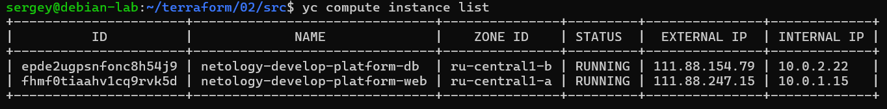

------

### Задание 4

1. Объявите в файле outputs.tf **один** output , содержащий: instance_name, external_ip, fqdn для каждой из ВМ в удобном лично для вас формате.(без хардкода!!!)
2. Примените изменения.

В качестве решения приложите вывод значений ip-адресов команды ```terraform output```.

------

1. Файл `outputs.tf`

```hcl
output "vms_info" {
  description = "Connection info for both VMs"
  value = {
    web = {
      instance_name = yandex_compute_instance.platform.name
      external_ip   = yandex_compute_instance.platform.network_interface.0.nat_ip_address
      fqdn          = yandex_compute_instance.platform.fqdn
    }
    db = {
      instance_name = yandex_compute_instance.platform_db.name
      external_ip   = yandex_compute_instance.platform_db.network_interface.0.nat_ip_address
      fqdn          = yandex_compute_instance.platform_db.fqdn
    }
  }
}
```

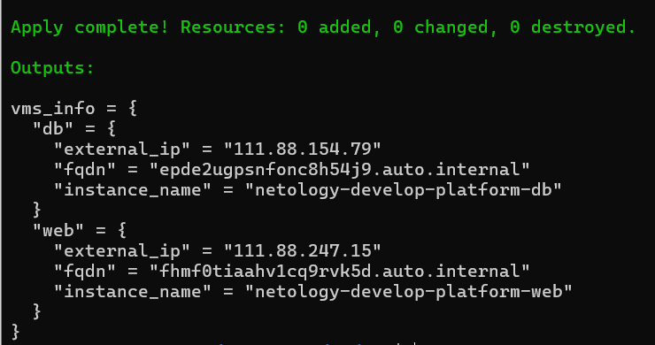

------

### Задание 5

1. В файле locals.tf опишите в **одном** local-блоке имя каждой ВМ, используйте интерполяцию ${..} с НЕСКОЛЬКИМИ переменными по примеру из лекции.
2. Замените переменные внутри ресурса ВМ на созданные вами local-переменные.
3. Примените изменения.

------

### Решение

- Добавил в `variables.tf` переменные

```hcl
### Naming vars

variable "project_name" {
  type        = string
  default     = "netology"
  description = "Project name prefix"
}

variable "env_name" {
  type        = string
  default     = "develop"
  description = "Environment name"
}

variable "service_name" {
  type        = string
  default     = "platform"
  description = "Service name"
}

variable "vm_web_role" {
  type        = string
  default     = "web"
  description = "Role for web instance"
}

variable "vm_db_role" {
  type        = string
  default     = "db"
  description = "Role for database instance"
}
```

- Объявил блок `locals` в файле `locals.tf`

```hcl
locals {
  vm_web_name = "${var.project_name}-${var.env_name}-${var.service_name}-${var.vm_web_role}"
  vm_db_name  = "${var.project_name}-${var.env_name}-${var.service_name}-${var.vm_db_role}"
}
```

- В файле `main.tf` в ресурсах инстансов заменил переменные на локальные (добавил `hostname`)

```hcl
# ...

resource "yandex_compute_instance" "platform" {
  name        = local.vm_web_name
  hostname    = local.vm_web_name

# ...

resource "yandex_compute_instance" "platform_db" {
  name        = local.vm_db_name
  hostname    = local.vm_db_name


# ...
```

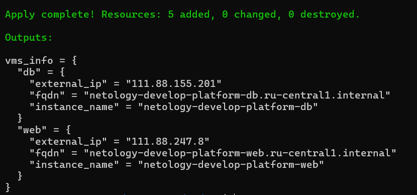

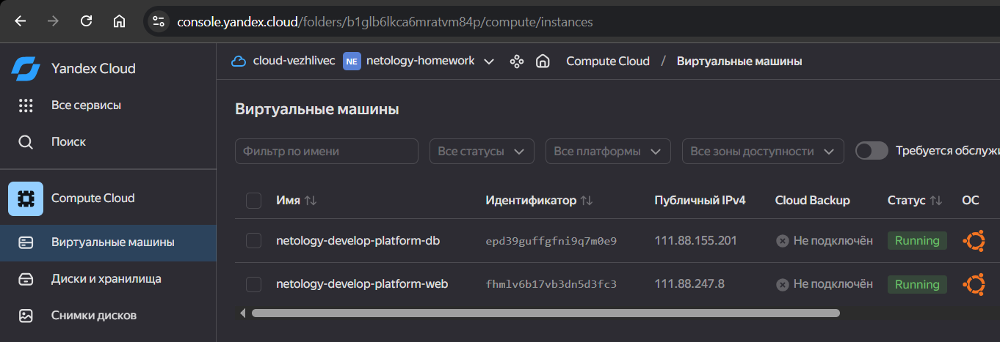

------

### Задание 6

1. Вместо использования трёх переменных  ".._cores",".._memory",".._core_fraction" в блоке  resources {...}, объедините их в единую map-переменную **vms_resources** и  внутри неё конфиги обеих ВМ в виде вложенного map(object).  
   ```
   пример из terraform.tfvars:
   vms_resources = {
     web={
       cores=2
       memory=2
       core_fraction=5
       hdd_size=10
       hdd_type="network-hdd"
       ...
     },
     db= {
       cores=2
       memory=4
       core_fraction=20
       hdd_size=10
       hdd_type="network-ssd"
       ...
     }
   }
   ```
3. Создайте и используйте отдельную map(object) переменную для блока metadata, она должна быть общая для всех ваших ВМ.
   ```
   пример из terraform.tfvars:
   metadata = {
     serial-port-enable = 1
     ssh-keys           = "ubuntu:ssh-ed25519 AAAAC..."
   }
   ```  
  
5. Найдите и закоментируйте все, более не используемые переменные проекта.
6. Проверьте terraform plan. Изменений быть не должно.

------

### Решение

1. В файл `vms_platform.tf` добавляем

```hcl
# ...

### VM Resources Configuration

variable "vms_resources" {
  description = "Resource configuration for VMs"
  type = map(
    object({
      cores         = number
      memory        = number
      core_fraction = number
    })
  )
  default = {
    web = {
      cores         = 2
      memory        = 1
      core_fraction = 20
    }
    db = {
      cores         = 2
      memory        = 2
      core_fraction = 20
    }
  }
}
```

В файле `main.tf` меняем

```hcl
# ...

  resources {
#    cores         = var.vm_web_cores
#    memory        = var.vm_web_memory
#    core_fraction = var.vm_web_core_fraction
    cores         = var.vms_resources["web"].cores
    memory        = var.vms_resources["web"].memory
    core_fraction = var.vms_resources["web"].core_fraction
  }

# ...

  resources {
#    cores         = var.vm_db_cores
#    memory        = var.vm_db_memory
#    core_fraction = var.vm_db_core_fraction
    cores         = var.vms_resources["db"].cores
    memory        = var.vms_resources["db"].memory
    core_fraction = var.vms_resources["db"].core_fraction
  }
```

2. В файле `variables.tf`

```hcl
### Metadata

variable "metadata" {
  description = "Metadata for VMs"
  type        = map(string)
  default = {
    serial-port-enable = "1"
  }
}
```

Ключ, хоть и публичный, но светить душа не лежит, поэтому перенесем его в `locals`

```hcl
locals {

# ...

  vm_metadata = merge(
    var.metadata,
    { ssh-keys = "ubuntu:${var.vms_ssh_root_key}" }
  )
}
```

В файле `main.tf` будем использовать ресурсах локальную переменную

```hcl
  metadata = local.vm_metadata
```

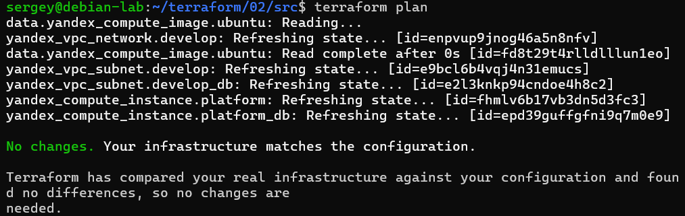

------

## Дополнительное задание (со звёздочкой*)

**Настоятельно рекомендуем выполнять все задания со звёздочкой.**   
Они помогут глубже разобраться в материале. Задания со звёздочкой дополнительные, не обязательные к выполнению и никак не повлияют на получение вами зачёта по этому домашнему заданию. 


------
### Задание 7*

Изучите содержимое файла console.tf. Откройте terraform console, выполните следующие задания: 

1. Напишите, какой командой можно отобразить **второй** элемент списка test_list.
2. Найдите длину списка test_list с помощью функции length(<имя переменной>).
3. Напишите, какой командой можно отобразить значение ключа admin из map test_map.
4. Напишите interpolation-выражение, результатом которого будет: "John is admin for production server based on OS ubuntu-20-04 with X vcpu, Y ram and Z virtual disks", используйте данные из переменных test_list, test_map, servers и функцию length() для подстановки значений.

**Примечание**: если не догадаетесь как вычленить слово "admin", погуглите: "terraform get keys of map"

В качестве решения предоставьте необходимые команды и их вывод.

------

### Решение

```hcl
local.test_list[1]
length(local.test_list)
local.test_map["admin"]
# или
local.test_map.admin
"${local.test_map["admin"]} is ${keys(local.test_map)[0]} for ${local.test_list[2]} server based on OS ${local.servers["production"].image} with ${local.servers["production"].cpu} vcpu, ${local.servers["production"].ram} ram and ${length(local.servers["production"].disks)} virtual disks"
```

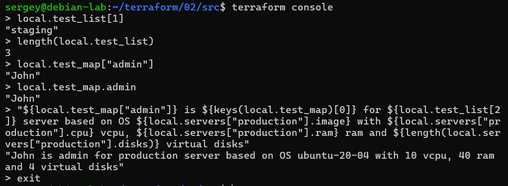

------

### Задание 8*
1. Напишите и проверьте переменную test и полное описание ее type в соответствии со значением из terraform.tfvars:
```
test = [
  {
    "dev1" = [
      "ssh -o 'StrictHostKeyChecking=no' ubuntu@62.84.124.117",
      "10.0.1.7",
    ]
  },
  {
    "dev2" = [
      "ssh -o 'StrictHostKeyChecking=no' ubuntu@84.252.140.88",
      "10.0.2.29",
    ]
  },
  {
    "prod1" = [
      "ssh -o 'StrictHostKeyChecking=no' ubuntu@51.250.2.101",
      "10.0.1.30",
    ]
  },
]
```
2. Напишите выражение в terraform console, которое позволит вычленить строку "ssh -o 'StrictHostKeyChecking=no' ubuntu@62.84.124.117" из этой переменной.

------

1. Объявим переменную `test` в файле`test_var.tf` со структурой list(map(list(string)))

```hcl
variable "test" {
  type = list(map(list(string)))
  default = [
    {
      "dev1" = [
        "ssh -o 'StrictHostKeyChecking=no' ubuntu@62.84.124.117",
        "10.0.1.7",
      ]
    },
    {
      "dev2" = [
        "ssh -o 'StrictHostKeyChecking=no' ubuntu@84.252.140.88",
        "10.0.2.29",
      ]
    },
    {
      "prod1" = [
        "ssh -o 'StrictHostKeyChecking=no' ubuntu@51.250.2.101",
        "10.0.1.30",
      ]
    },
  ]
}
```

В консоли выполним команду

```hcl
var.test[0]["dev1"][0]
```

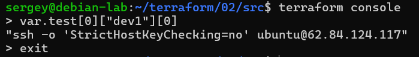

------

### Задание 9*

Используя инструкцию https://cloud.yandex.ru/ru/docs/vpc/operations/create-nat-gateway#tf_1, настройте для ваших ВМ nat_gateway. Для проверки уберите внешний IP адрес (nat=false) у ваших ВМ и проверьте доступ в интернет с ВМ, подключившись к ней через serial console. Для подключения предварительно через ssh измените пароль пользователя: ```sudo passwd ubuntu```

------

### Решение

- Сменил пароли

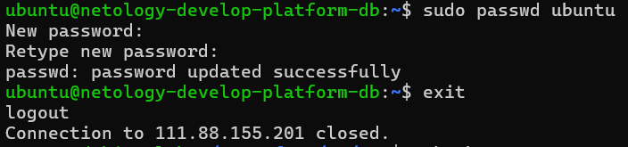

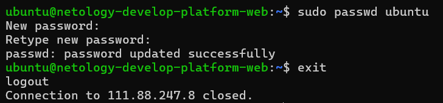

- Добавил в `main.tf` `gateway` и `таблицу маршрутизации`

```hcl
resource "yandex_vpc_gateway" "nat_gateway" {
  name = "${var.vpc_name}-shared-egress-gw"
  shared_egress_gateway {}
}

resource "yandex_vpc_route_table" "rt" {
  name       = "${var.vpc_name}-route-table"
  network_id = yandex_vpc_network.develop.id

  static_route {
    destination_prefix = "0.0.0.0/0"
    gateway_id         = yandex_vpc_gateway.nat_gateway.id
  }
}
```

- Так же в `main.tf` привязал подсети к `таблице маршрутизации`

```hcl
# ...

resource "yandex_vpc_subnet" "develop" {
  name           = var.vpc_name
  zone           = var.default_zone
  network_id     = yandex_vpc_network.develop.id
  v4_cidr_blocks = var.default_cidr
  route_table_id = yandex_vpc_route_table.rt.id # <- Здесь
}

resource "yandex_vpc_subnet" "develop_db" {
  name           = var.subnet_db_name
  zone           = var.default_db_zone
  network_id     = yandex_vpc_network.develop.id
  v4_cidr_blocks = var.default_db_cidr
  route_table_id = yandex_vpc_route_table.rt.id # <- И здесь
}

# ...
```

В `vms_platform.tf` в переменных `vm_web_nat` и `vm_db_nat` установил значение по умолчанию `false`

```hcl
# ...

variable "vm_web_nat" {
  description = "Enable public IP (NAT)"
  type        = bool
  default     = false
}

# ...

variable "vm_db_nat" {
  description = "Enable public IP (NAT)"
  type        = bool
  default     = false
}

# ...
```

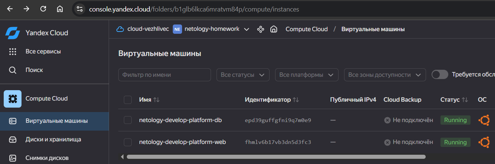

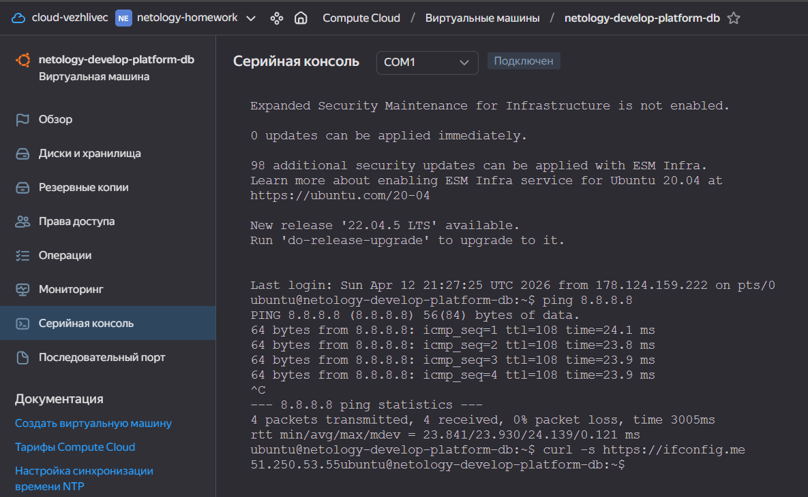

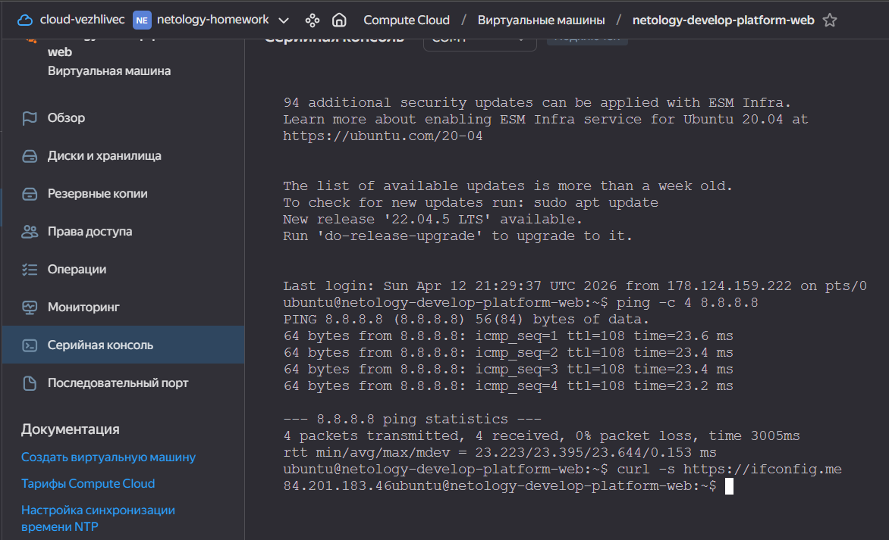

------

### Правила приёма работыДля подключения предварительно через ssh измените пароль пользователя: sudo passwd ubuntu
В качестве результата прикрепите ссылку на MD файл с описанием выполненой работы в вашем репозитории. Так же в репозитории должен присутсвовать ваш финальный код проекта.

**Важно. Удалите все созданные ресурсы**.


### Критерии оценки

Зачёт ставится, если:

* выполнены все задания,
* ответы даны в развёрнутой форме,
* приложены соответствующие скриншоты и файлы проекта,
* в выполненных заданиях нет противоречий и нарушения логики.

На доработку работу отправят, если:

* задание выполнено частично или не выполнено вообще,
* в логике выполнения заданий есть противоречия и существенные недостатки. 
