# Домашнее задание к занятию «Управляющие конструкции в коде Terraform»

### Цели задания

1. Отработать основные принципы и методы работы с управляющими конструкциями Terraform.
2. Освоить работу с шаблонизатором Terraform (Interpolation Syntax).

------

### Чек-лист готовности к домашнему заданию

1. Зарегистрирован аккаунт в Yandex Cloud. Использован промокод на грант.
2. Установлен инструмент Yandex CLI.
3. Доступен исходный код для выполнения задания в директории [**03/src**](https://github.com/netology-code/ter-homeworks/tree/main/03/src).
4. Любые ВМ, использованные при выполнении задания, должны быть прерываемыми, для экономии средств.

------

### Внимание!! Обязательно предоставляем на проверку получившийся код в виде ссылки на ваш github-репозиторий!
Убедитесь что ваша версия **Terraform** ~>1.12.0
Теперь пишем красивый код, хардкод значения не допустимы!
------

### Задание 1

1. Изучите проект.
2. Инициализируйте проект, выполните код. 


Приложите скриншот входящих правил «Группы безопасности» в ЛК Yandex Cloud .

------

### Решение

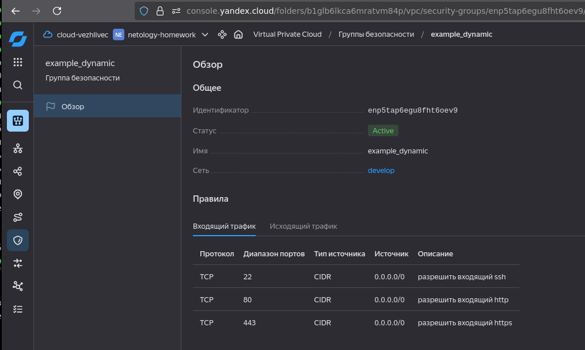

------

### Задание 2

1. Создайте файл count-vm.tf. Опишите в нём создание двух **одинаковых** ВМ  web-1 и web-2 (не web-0 и web-1) с минимальными параметрами, используя мета-аргумент **count loop**. Назначьте ВМ созданную в первом задании группу безопасности.(как это сделать узнайте в документации провайдера yandex/compute_instance )
2. Создайте файл for_each-vm.tf. Опишите в нём создание двух ВМ для баз данных с именами "main" и "replica" **разных** по cpu/ram/disk_volume , используя мета-аргумент **for_each loop**. Используйте для обеих ВМ одну общую переменную типа:
```
variable "each_vm" {
  type = list(object({  vm_name=string, cpu=number, ram=number, disk_volume=number }))
}
```  
При желании внесите в переменную все возможные параметры.
4. ВМ из пункта 2.1 должны создаваться после создания ВМ из пункта 2.2.
5. Используйте функцию file в local-переменной для считывания ключа ~/.ssh/id_rsa.pub и его последующего использования в блоке metadata, взятому из ДЗ 2.
6. Инициализируйте проект, выполните код.

------

### Решение

1. Создание `count-vm.tf`

```hcl
resource "yandex_compute_instance" "web" {
  count       = number_of_web

  name        = "${var.each_web_vm.name}-${count.index + 1}"
  hostname    = "${var.each_web_vm.name}-${count.index + 1}"

  platform_id = var.vm_platform_id

  resources {
    cores         = var.each_web_vm.resources.cores
    memory        = var.each_web_vm.resources.memory
    core_fraction = var.each_web_vm.resources.core_fraction
  }

  boot_disk {
    initialize_params {
      image_id = data.yandex_compute_image.ubuntu.image_id
      type     = var.each_web_vm.disk.type
      size     = var.each_web_vm.disk.size
    }
  }

  scheduling_policy {
    preemptible = var.each_web_vm.preemptible
  }

  network_interface {
    subnet_id = yandex_vpc_subnet.develop.id
    nat       = var.each_web_vm.nat
    security_group_ids = [yandex_vpc_security_group.example.id]
  }

  depends_on = [yandex_compute_instance.db]

  metadata = local.vm_metadata
}
```

В файл `variables.tf` добавил нужные переменные

```hcl
variable "vm_image_family" {
  description = "Image family for the boot disk"
  type        = string
  default     = "ubuntu-2004-lts"
}

variable "vm_platform_id" {
  description = "Platform ID"
  type        = string
  default     = "standard-v3"
}

variable "number_of_web" {
  type        = number
  default     = 2
  description = "Number of web VMs"
}

variable "each_web_vm" {
  description = "Resource configuration for VMs"
  type = object({
    name        = string
    resources   = object({
      cores         = number
      memory        = number
      core_fraction = number
    })
    disk        = object({
      type          = string
      size          = number
    })
    preemptible = bool
    nat         = bool
  })
  default = {
    name        = "web"
    resources   = {
      cores         = 2
      memory        = 1
      core_fraction = 20
    }
    disk        = {
      type          = "network-hdd"
      size          = 5
    }
    preemptible = true
    nat         = true
  }
}


variable "vms_ssh_root_key" {
  type        = string
  default     = "<your_ssh_ed25519_key>"
  description = "ssh-keygen -t ed25519"
}

### Metadata

variable "metadata" {
  description = "Metadata for VMs"
  type        = map(string)
  default = {
    serial-port-enable = "1"
  }
}
```

А также создал файл `locals.tf`

```hcl
locals {
  vm_metadata = merge(
    var.metadata,
    { ssh-keys = "ubuntu:${var.vms_ssh_root_key}" }
  )
}
```

2. Создание `for_each-vm.tf`

```hcl
resource "yandex_compute_instance" "db" {
  for_each = { for vm in var.each_vm : vm.vm_name => vm }
  
  name        = "db-${each.key}"
  hostname    = "db-${each.key}"
  platform_id = var.vm_platform_id
  
  resources {
    cores         = each.value.cpu
    memory        = each.value.ram
    core_fraction = each.value.core_fraction 
  }
  
  boot_disk {
    initialize_params {
      image_id = data.yandex_compute_image.ubuntu.image_id
      type     = each.value.disk_type
      size     = each.value.disk_volume
    }
  }

  scheduling_policy {
    preemptible = each.value.preemptible
  }

  network_interface {
    subnet_id          = yandex_vpc_subnet.develop.id
    nat                = each.value.nat
    security_group_ids = [yandex_vpc_security_group.example.id]
  }
  
  metadata = local.vm_metadata
}
```

Добавил переменную в `variables.tf`

```hcl
variable "each_vm" {
  type = list(object({
    vm_name       = string
    cpu           = number
    ram           = number
    core_fraction = number
    disk_type     = string
    disk_volume   = number
    preemptible   = bool
    nat           = bool
  }))
  
  default = [
    {
      vm_name       = "main"
      cpu           = 2
      ram           = 1
      core_fraction = 20
      disk_type     = "network-hdd"
      disk_volume   = 5
      preemptible   = true
      nat           = true
    },
    {
      vm_name       = "replica"
      cpu           = 2
      ram           = 1
      core_fraction = 20
      disk_type     = "network-hdd"
      disk_volume   = 5
      preemptible   = true
      nat           = true
    }
  ]
}
```

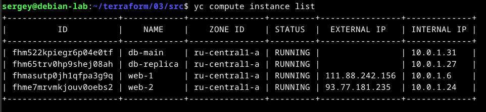

------

### Задание 3

1. Создайте 3 одинаковых виртуальных диска размером 1 Гб с помощью ресурса yandex_compute_disk и мета-аргумента count в файле **disk_vm.tf** .
2. Создайте в том же файле **одиночную**(использовать count или for_each запрещено из-за задания №4) ВМ c именем "storage"  . Используйте блок **dynamic secondary_disk{..}** и мета-аргумент for_each для подключения созданных вами дополнительных дисков.

------

### Решение

1. Создание 3 одинаковых виртуальных диска (файл `disk_vm.tf`)

```hcl
resource "yandex_compute_disk" "storage_vol" {
  count = var.storage_disk_config.count

  name   = "storage-vol-${count.index + 1}"
  type   = var.storage_disk_config.type
  zone   = var.default_zone
  size   = var.storage_disk_config.size
  labels = { purpose = "additional-storage" }
}
```

Добавление переменной в `variables.tf`

```hcl
variable "storage_disk_config" {
  description = "Parameters of additional disks for VM storage"
  type = object({
    count = number
    type  = string
    size  = number
  })

  default = {
    count = 3
    type  = "network-hdd"
    size  = 1
  }
}
``` 

2. Создание ВМ `storage` в `disk_vm.tf`

```hcl
resource "yandex_compute_instance" "storage" {
  name        = var.storage_vm.name
  hostname    = var.storage_vm.name
  platform_id = var.vm_platform_id
  zone        = var.default_zone

  resources {
    cores         = var.storage_vm.resources.cores
    memory        = var.storage_vm.resources.memory
    core_fraction = var.storage_vm.resources.core_fraction
  }

  boot_disk {
    initialize_params {
      image_id = data.yandex_compute_image.ubuntu.image_id
      type     = var.storage_vm.boot_disk.type
      size     = var.storage_vm.boot_disk.size
    }
  }

  network_interface {
    subnet_id          = yandex_vpc_subnet.develop.id
    nat                = var.storage_vm.network.nat
    security_group_ids = [yandex_vpc_security_group.example.id]
  }

  scheduling_policy {
    preemptible = var.storage_vm.scheduling.preemptible
  }

  metadata = local.vm_metadata

  dynamic "secondary_disk" {
    for_each = toset(yandex_compute_disk.storage_vol[*].id)
    content {
      disk_id = secondary_disk.value
      mode    = "READ_WRITE"
    }
  }

  depends_on = [yandex_compute_disk.storage_vol]
}
```

Добавление переменной в variables.tf

```hcl
variable "storage_vm" {
  description = "Virtual machine storage parameters"
  type = object({
    name = string
    resources = object({
      cores         = number
      memory        = number
      core_fraction = number
    })
    boot_disk = object({
      type = string
      size = number
    })
    network = object({
      nat = bool
    })
    scheduling = object({
      preemptible = bool
    })
  })

  default = {
    name = "storage"
    resources = {
      cores         = 2
      memory        = 2
      core_fraction = 20
    }
    boot_disk = {
      type = "network-hdd"
      size = 10
    }
    network = {
      nat = false
    }
    scheduling = {
      preemptible = true
    }
  }
}
```

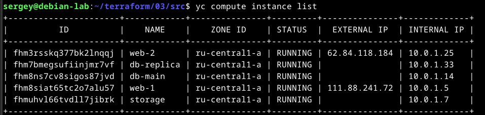

```bash
yc compute instance get storage --format yaml
```

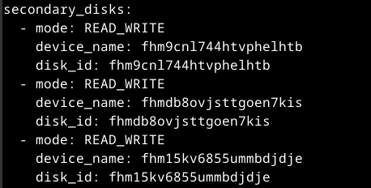

------

### Задание 4

1. В файле ansible.tf создайте inventory-файл для ansible.
Используйте функцию tepmplatefile и файл-шаблон для создания ansible inventory-файла из лекции.
Готовый код возьмите из демонстрации к лекции [**demonstration2**](https://github.com/netology-code/ter-homeworks/tree/main/03/demo).
Передайте в него в качестве переменных группы виртуальных машин из задания 2.1, 2.2 и 3.2, т. е. 5 ВМ.
2. Инвентарь должен содержать 3 группы и быть динамическим, т. е. обработать как группу из 2-х ВМ, так и 999 ВМ.
3. Добавьте в инвентарь переменную  [**fqdn**](https://cloud.yandex.ru/docs/compute/concepts/network#hostname).
``` 
[webservers]
web-1 ansible_host=<внешний ip-адрес> fqdn=<полное доменное имя виртуальной машины>
web-2 ansible_host=<внешний ip-адрес> fqdn=<полное доменное имя виртуальной машины>

[databases]
main ansible_host=<внешний ip-адрес> fqdn=<полное доменное имя виртуальной машины>
replica ansible_host<внешний ip-адрес> fqdn=<полное доменное имя виртуальной машины>

[storage]
storage ansible_host=<внешний ip-адрес> fqdn=<полное доменное имя виртуальной машины>
```
Пример fqdn: ```web1.ru-central1.internal```(в случае указания переменной hostname(не путать с переменной name)); ```fhm8k1oojmm5lie8i22a.auto.internal```(в случае отсутвия перменной hostname - автоматическая генерация имени,  зона изменяется на auto). нужную вам переменную найдите в документации провайдера или terraform console.
4. Выполните код. Приложите скриншот получившегося файла. 

Для общего зачёта создайте в вашем GitHub-репозитории новую ветку terraform-03. Закоммитьте в эту ветку свой финальный код проекта, пришлите ссылку на коммит.   
**Удалите все созданные ресурсы**.

------

### Решение

Файл `ansible.tf`

```hcl
resource "local_file" "ansible_inventory" {
  content = templatefile("${path.module}/hosts.tftpl", {
    webservers = yandex_compute_instance.web
    databases  = yandex_compute_instance.db
    storage    = yandex_compute_instance.storage
  })
  filename = "${abspath(path.module)}/hosts.ini"
}
```

Файл `hosts.tftpl`

```hcl
[webservers]
%{ for i in webservers ~}
${i["name"]} ansible_host=${i["network_interface"][0]["nat_ip_address"] != "" ? i["network_interface"][0]["nat_ip_address"] : i["network_interface"][0]["ip_address"]} fqdn=${i["fqdn"]}
%{ endfor ~}

[databases]
%{ for name, vm in databases ~}
${name} ansible_host=${vm["network_interface"][0]["nat_ip_address"] != "" ? vm["network_interface"][0]["nat_ip_address"] : vm["network_interface"][0]["ip_address"]} fqdn=${vm["fqdn"]}
%{ endfor ~}

[storage]
${storage["name"]} ansible_host=${storage["network_interface"][0]["nat_ip_address"] != "" ? storage["network_interface"][0]["nat_ip_address"] : storage["network_interface"][0]["ip_address"]} fqdn=${storage["fqdn"]}
```

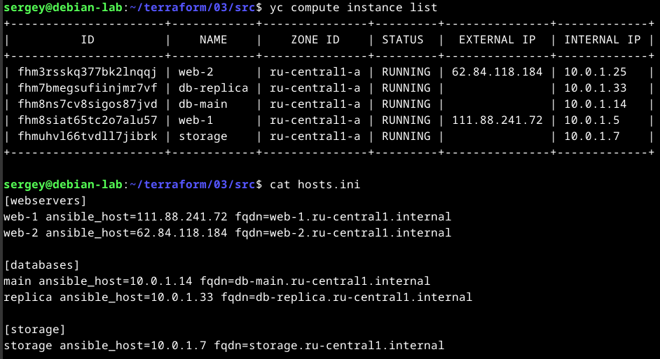

------

## Дополнительные задания (со звездочкой*)

**Настоятельно рекомендуем выполнять все задания со звёздочкой.** Они помогут глубже разобраться в материале.   
Задания со звёздочкой дополнительные, не обязательные к выполнению и никак не повлияют на получение вами зачёта по этому домашнему заданию. 

### Задание 5* (необязательное)
1. Напишите output, который отобразит ВМ из ваших ресурсов count и for_each в виде списка словарей :
``` 
[
 {
  "name" = 'имя ВМ1'
  "id"   = 'идентификатор ВМ1'
  "fqdn" = 'Внутренний FQDN ВМ1'
 },
 {
  "name" = 'имя ВМ2'
  "id"   = 'идентификатор ВМ2'
  "fqdn" = 'Внутренний FQDN ВМ2'
 },
 ....
...итд любое количество ВМ в ресурсе(те требуется итерация по ресурсам, а не хардкод) !!!!!!!!!!!!!!!!!!!!!
]
```
Приложите скриншот вывода команды ```terrafrom output```.

------

### Решение

Файл `outputs.tf`

```hcl
output "vms_info" {
  value = concat(
    [for vm in yandex_compute_instance.web : {
      name = vm.name
      id   = vm.id
      fqdn = vm.fqdn
    }],
    
    [for db_key, vm in yandex_compute_instance.db : {
      name = vm.name
      id   = vm.id
      fqdn = vm.fqdn
    }],

    [{
      name = yandex_compute_instance.storage.name
      id   = yandex_compute_instance.storage.id
      fqdn = yandex_compute_instance.storage.fqdn
    }]
  )
}
```

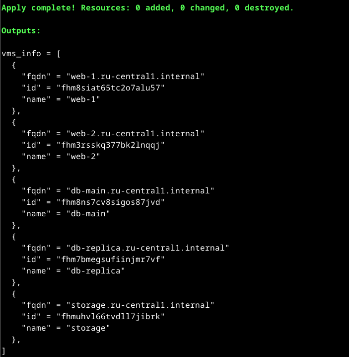

------

### Задание 6* (необязательное)

1. Используя null_resource и local-exec, примените ansible-playbook к ВМ из ansible inventory-файла.
Готовый код возьмите из демонстрации к лекции [**demonstration2**](https://github.com/netology-code/ter-homeworks/tree/main/03/demo).
3. Модифицируйте файл-шаблон hosts.tftpl. Необходимо отредактировать переменную ```ansible_host="<внешний IP-address или внутренний IP-address если у ВМ отсутвует внешний адрес>```.

Для проверки работы уберите у ВМ внешние адреса(nat=false). Этот вариант используется при работе через bastion-сервер.
Для зачёта предоставьте код вместе с основной частью задания.

------

### Решение

Найдем первую ВМ с внешним `IP` (если есть) и будем считать ее `бастионом` (естественно, должно быть разрешение на подключение по `ssh`).

В файле `locals.tf`

```hcl
locals {

  # ...

  all_vms = concat(
    yandex_compute_instance.web,
    values(yandex_compute_instance.db),
    [yandex_compute_instance.storage]
  )

  bastion_ip = try(
    [for vm in local.all_vms : vm.network_interface[0].nat_ip_address if vm.network_interface[0].nat_ip_address != ""][0],
    ""
  )

}
```

Передадим ее в шаблон

```hcl
resource "local_file" "ansible_inventory" {
  content = templatefile("${path.module}/hosts.tftpl", {
    webservers = yandex_compute_instance.web
    databases  = yandex_compute_instance.db
    storage    = yandex_compute_instance.storage

    bastion_ip = local.bastion_ip # <- Добавил
  })
  filename = "${abspath(path.module)}/hosts.ini"
}
```

Теперь, если `bastion_ip` не пустой, то создадим группу `[internal]`, в которую запишем все ВМ, у которых нет внешнего `IP`. И определим переменную `ansible_ssh_common_args` так, чтобы к ВМ с внутренними `IP` можно было подключиться через `"бастион"`. Хотя, если не найдется ни одной ВМ с внешним `IP`, то инвентарь будет странный.

```hcl
# ...

%{ if bastion_ip != "" ~}

[internal]

%{ for i in webservers ~}
%{ if i["network_interface"][0]["nat_ip_address"] == "" ~}
${i["name"]}
%{ endif ~}
%{ endfor ~}

%{ for name, vm in databases ~}
%{ if vm["network_interface"][0]["nat_ip_address"] == "" ~}
${name}
%{ endif ~}
%{ endfor ~}

%{ if storage["network_interface"][0]["nat_ip_address"] == "" ~}
${storage["name"]}
%{ endif ~}

[internal:vars]
ansible_user=ubuntu
ansible_ssh_common_args='-o ProxyCommand="ssh -W %h:%p -o StrictHostKeyChecking=no -i ~/.ssh/id_rsa ubuntu@${bastion_ip}"'

%{ endif ~}
```

Создам минималистичный `playbook.yml`, который протестирует соединение.

```yaml
---
- name: Checking infrastructure availability
  hosts: all
  gather_facts: false
  tasks:
    - name: Wait for SSH to be ready
      wait_for_connection:
        delay: 10
        timeout: 120
        sleep: 5

    - name: Test SSH connection
      ping:
```

В файл `ansible.tf` добавил запуск `Ansible`

```hcl
# ...

resource "null_resource" "ansible_provision" {

  depends_on = [
    yandex_compute_instance.web,
    yandex_compute_instance.db,
    yandex_compute_instance.storage,
    local_file.ansible_inventory
  ]

  provisioner "local-exec" {
    command = <<-EOT
      ANSIBLE_HOST_KEY_CHECKING=False \
      ansible-playbook \
        -i ${abspath(path.module)}/hosts.ini \
        ${abspath(path.module)}/playbook.yml \
        -u ubuntu \
        --private-key ~/.ssh/id_rsa
    EOT
    on_failure = continue
  }
}
```

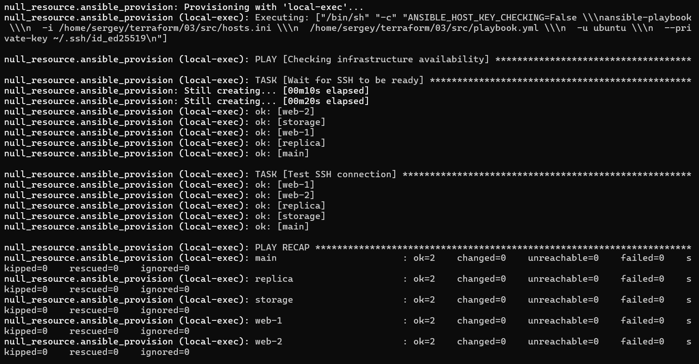

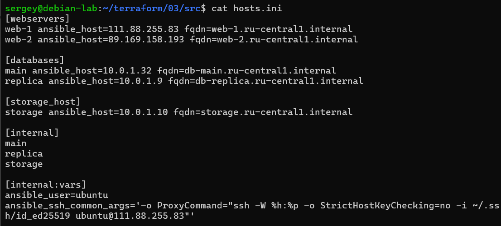

------

### Правила приёма работы

В своём git-репозитории создайте новую ветку terraform-03, закоммитьте в эту ветку свой финальный код проекта. Ответы на задания и необходимые скриншоты оформите в md-файле в ветке terraform-03.

В качестве результата прикрепите ссылку на ветку terraform-03 в вашем репозитории.

Важно. Удалите все созданные ресурсы.

### Задание 7* (необязательное)
Ваш код возвращает вам следущий набор данных: 
```
> local.vpc
{
  "network_id" = "enp7i560tb28nageq0cc"
  "subnet_ids" = [
    "e9b0le401619ngf4h68n",
    "e2lbar6u8b2ftd7f5hia",
    "b0ca48coorjjq93u36pl",
    "fl8ner8rjsio6rcpcf0h",
  ]
  "subnet_zones" = [
    "ru-central1-a",
    "ru-central1-b",
    "ru-central1-c",
    "ru-central1-d",
  ]
}
```
Предложите выражение в terraform console, которое удалит из данной переменной 3 элемент из: subnet_ids и subnet_zones.(значения могут быть любыми) Образец конечного результата:
```
> <некое выражение>
{
  "network_id" = "enp7i560tb28nageq0cc"
  "subnet_ids" = [
    "e9b0le401619ngf4h68n",
    "e2lbar6u8b2ftd7f5hia",
    "fl8ner8rjsio6rcpcf0h",
  ]
  "subnet_zones" = [
    "ru-central1-a",
    "ru-central1-b",
    "ru-central1-d",
  ]
}
```

------

### Решение

```hcl
merge(local.vpc, {
  subnet_ids   = [for i, v in local.vpc.subnet_ids : v if i != 2]
  subnet_zones = [for i, v in local.vpc.subnet_zones : v if i != 2]
})
```

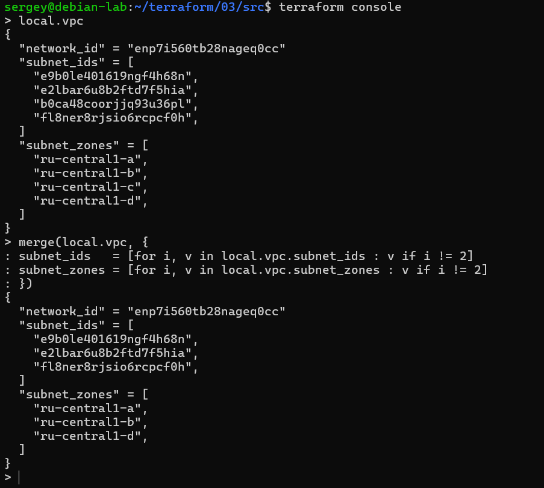

------

### Задание 8* (необязательное)
Идентифицируйте и устраните намеренно допущенную в tpl-шаблоне ошибку. Обратите внимание, что terraform сам сообщит на какой строке и в какой позиции ошибка!
```
[webservers]
%{~ for i in webservers ~}
${i["name"]} ansible_host=${i["network_interface"][0]["nat_ip_address"] platform_id=${i["platform_id "]}}
%{~ endfor ~}
```

------

### Решение

Предоставленный код поместил в файл `hosts_err.tftpl`, и временно в файле `ansible.tf` указал его в качестве шаблона. Выполнил `terraform plan`

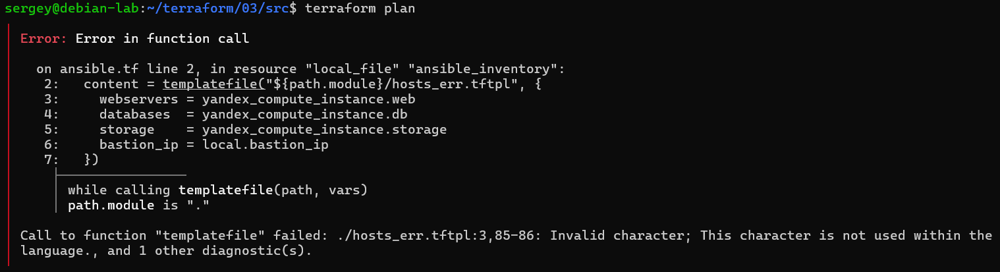

Позиция ошибки указывает на `{`

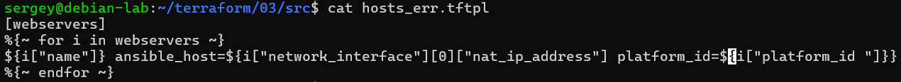

Предыдущая интерполяция не закрыта (пропущена `}`). После исправления получается лишняя закрывающая `}` в конце. Снова запускаем `terraform plan` (на самом деле лишний пробел я сразу увидел)

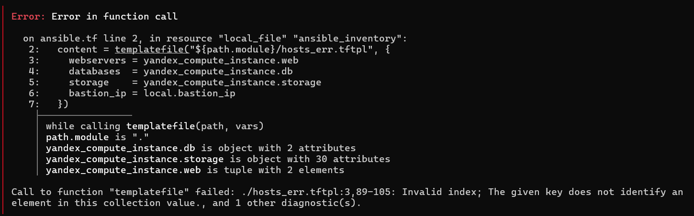

Позиция ошибки указывает на `["platform_id "]`.

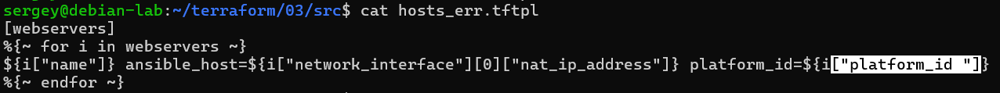

Убираем лишний пробел - теперь план проходит без ошибок.

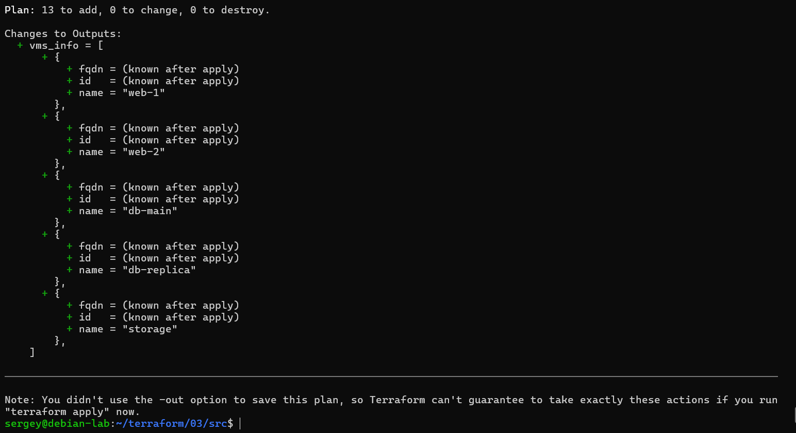

------

### Задание 9* (необязательное)
Напишите  terraform выражения, которые сформируют списки:
1. ["rc01","rc02","rc03","rc04",rc05","rc06",rc07","rc08","rc09","rc10....."rc99"] те список от "rc01" до "rc99"
2. ["rc01","rc02","rc03","rc04",rc05","rc06","rc11","rc12","rc13","rc14",rc15","rc16","rc19"....."rc96"] те список от "rc01" до "rc96", пропуская все номера, заканчивающиеся на "0","7", "8", "9", за исключением "rc19"

------

### Решение

```hcl
[for i in range(1, 100) : format("rc%02d", i)]
[for i in range(1, 97) : format("rc%02d", i) if i == 19 || !contains([0, 7, 8, 9], i % 10)]
```

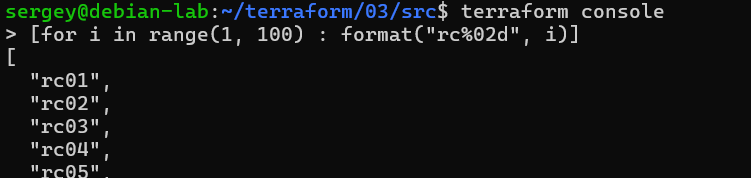

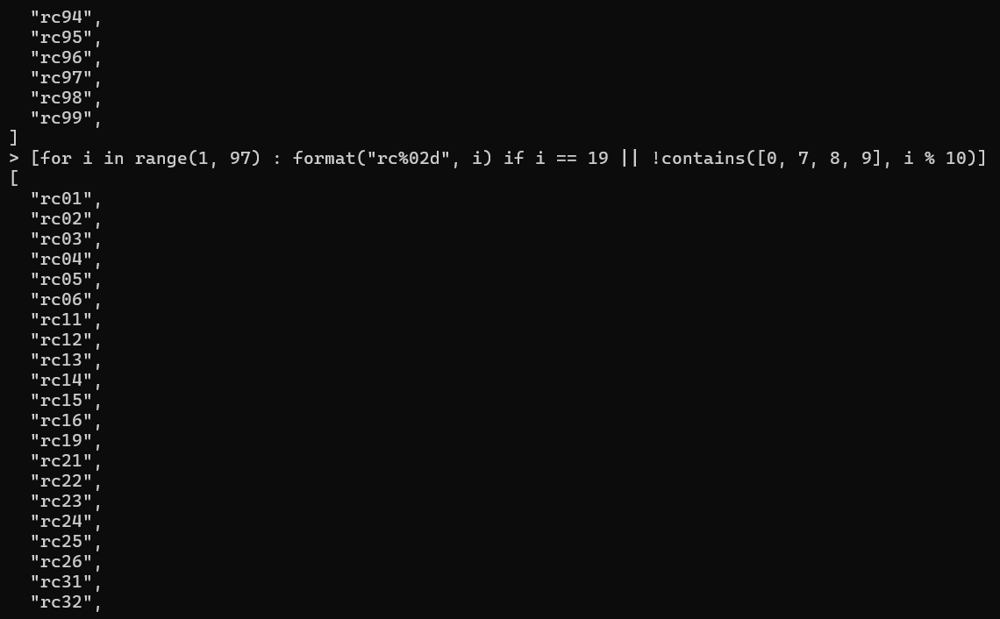

------
### Критерии оценки

Зачёт ставится, если:

* выполнены все задания,
* ответы даны в развёрнутой форме,
* приложены соответствующие скриншоты и файлы проекта,
* в выполненных заданиях нет противоречий и нарушения логики.

На доработку работу отправят, если:

* задание выполнено частично или не выполнено вообще,
* в логике выполнения заданий есть противоречия и существенные недостатки. 
